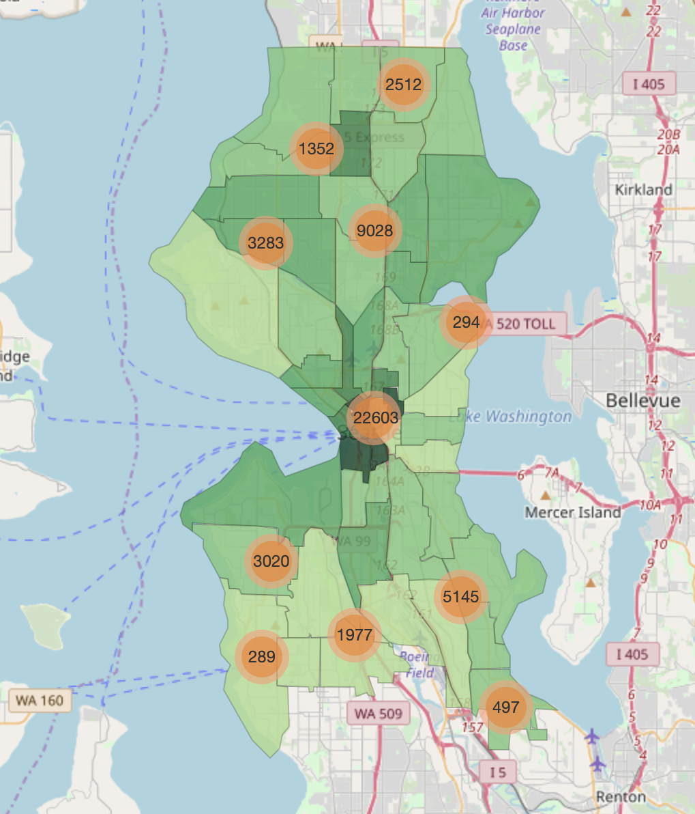
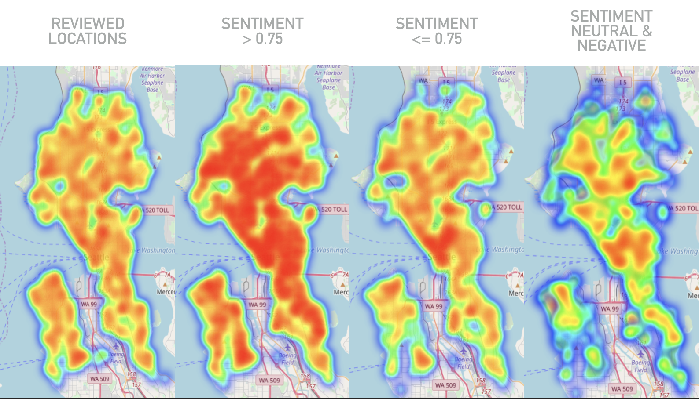
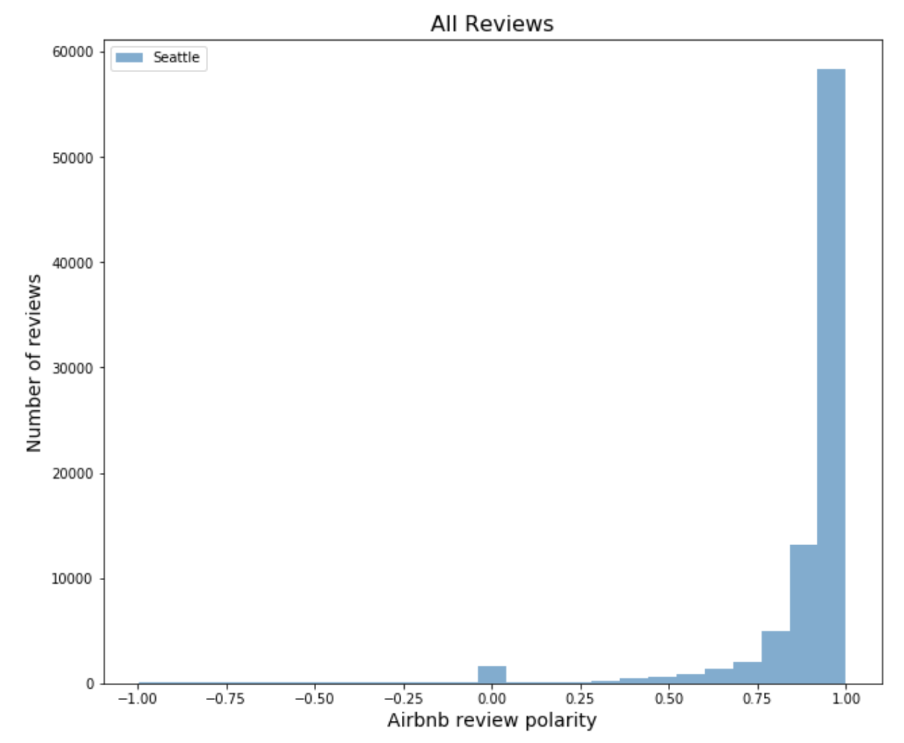
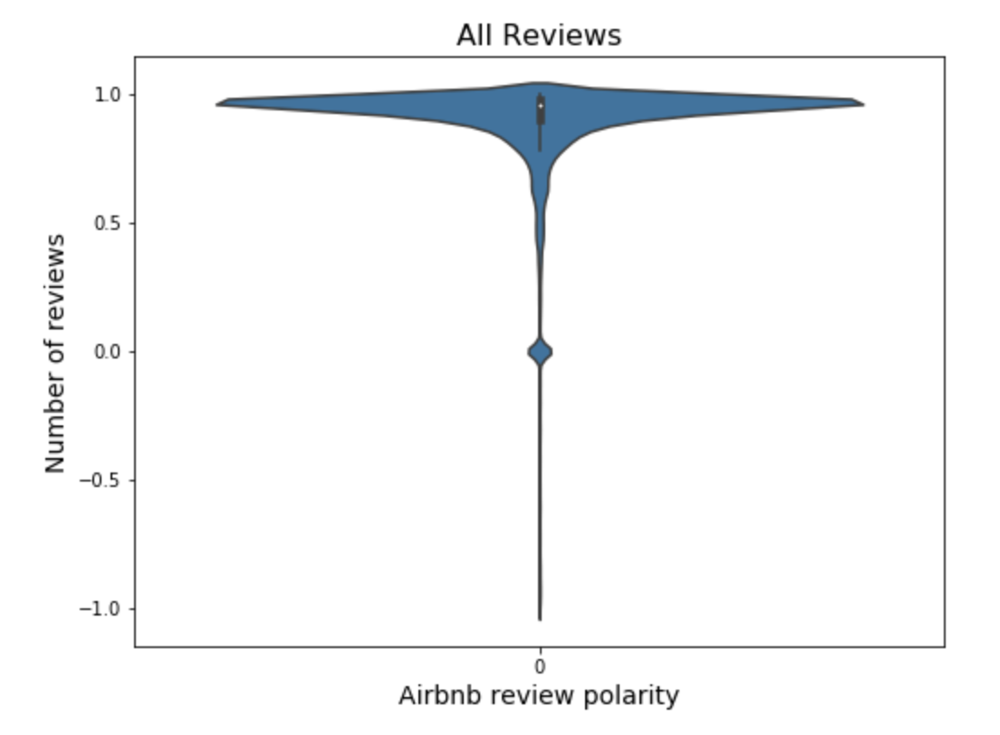
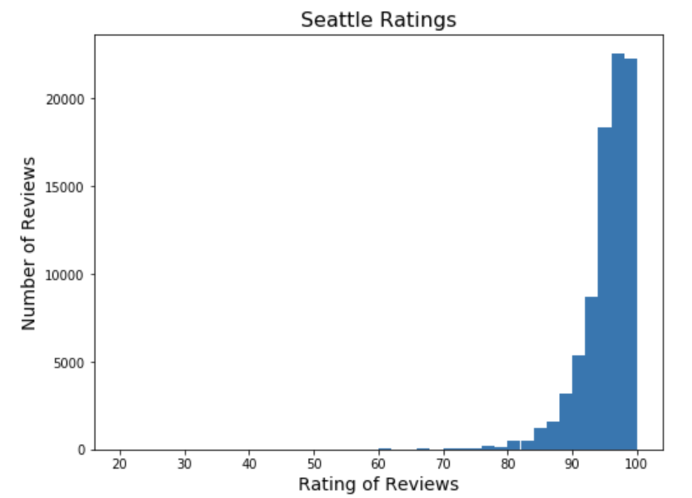
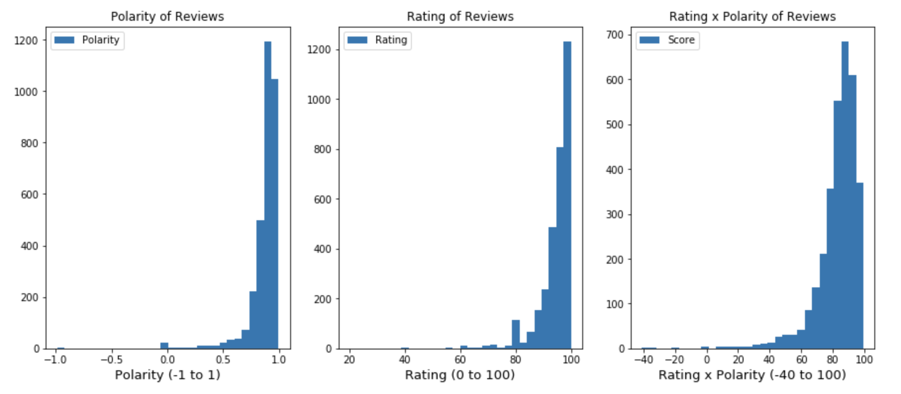
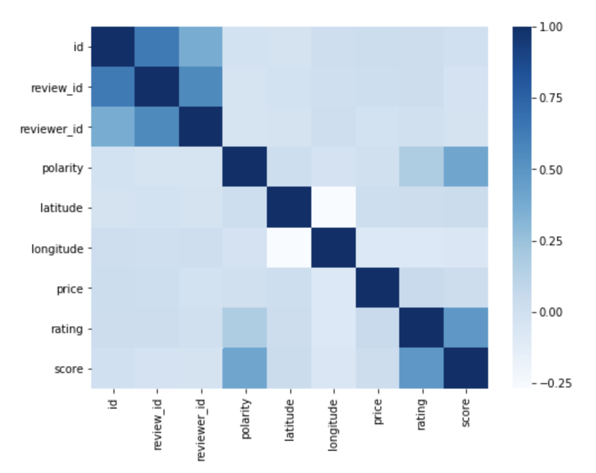
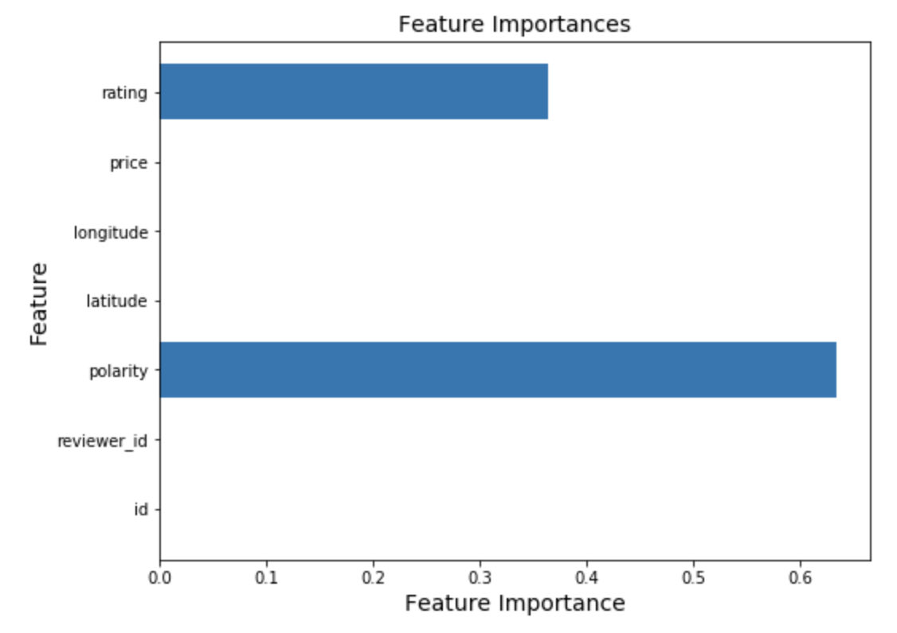

# Andrew Wester Capstone Project
## Flatiron School - Online Full Time Data Science, October 2018 Cohort
#### Instructor: Rafael Carrasco

## Project: Seattle Washington, Summary

## Question: What Factors Influence Airbnb Reviews
### How do those reviews compare with locations of crime in the city?

## Goal: Visually Represent Locations of Airbnb Rentals Relative to Review, as well as Crime

## Data:

I gathered my data from Kaggle, and from searching different websites for data relating to Seattle, Washington.  The original data I started with was from the Pronto Cycle Share company's data set that was on Kaggle.com.  After starting by examining this data, I found date from Airbnb on Kaggle as well.  I initially found a dataset from Kaggle that had crime data from Seattle, WA, but I looked online and found other options, although ended up going to a different Kaggle dataset with 1.4 million responses from 2009 onwards.

* Airbnb Data from [Kaggle](https://www.kaggle.com/airbnb/seattle)
* Seattle Police Department from [Kaggle](https://www.kaggle.com/sohier/seattle-police-department-911-incident-response#Seattle_Police_Department_911_Incident_Response.csv)
* Pronto Cycle Share Data from [Kaggle](https://www.kaggle.com/pronto/cycle-share-dataset)

## Initial Thoughts:
While my initial goals for this project were reaching for the stars a bit, they were well-founded, albeit turned out to be much more difficult than initially anticipated.  My original goals for a final project were to have a dashboard where someone could see pricing of housing markets, as well as overall citizen/customer sentiment geared towards Airbnb and Criminal activity in seattle.  The goal was also to be able to relate cycle sharing trips to Airbnb and crime data, as today's society has grown more accustomed to using ride sharing companies, as well as cycle sharing and other forms of public transportation, especially in heavily populated cities such as Seattle.  While these are useful for those who work in the city and commute often, for those who live in the city, it is also a necessity in order to get around without personal transportation in the tight city streets.  If this data can be used in order to assist someone in their search of a new home or apartment, as well as perhaps for some to consider future markets for real estate development for new apartment complexes, or areas in need of better office parks.

While this did not come to fruition as originally imagined, I was still intrigued to have learned about the different areas that were hotspots for [Crime](), Airbnb rentals, and cycle share locations.

## Visualizations:
#### Folium:
A lot of the visualizations in this project revolved around Folium and plotting points geographically on a map.  While the use of Folium can be slow to render and difficult to work with at times, the results are fantastic in the ability to plot points and see geographically where locations lie relative to each other.  There are also great ways to add different layers in order to toggle between certain data or certain ways of identifying such data on the map.

## Sentiment Analysis on Airbnb Reviews:
One challenge I really looked to try and tackle with this project was the idea of analyzing the text in reviews, and I fortunately was able to find a library build into the Natural Language Tool Kit that allows [Sentiment Analysis](https://www.nltk.org/api/nltk.sentiment.html#module-nltk.sentiment.vader) on the text.  Using this, the Vader Polarity gives a value from negative to positive one from most negative to most positive text.  Each review could then be assessed a polarity value that could be plotted (see below).

        
As is clearly evident, there is an extreme shift towards the positive with reviews' sentiment.  This obviously led to more exploration about what locations were showing the highest and lowest sentiment, as well as whether the ratings assessed to a location matched with the sentiment of their comments.

So ratings were high, as was sentiment analysis, so they certainly go hand in hand.  This leads to my machine learning model and how to classify the ratingand quality of a review.

## Machine Learning Model:
Starting with a very basic model, I realized that there was going to be good results for any test because there were very few features in the model, and the features that were there were using polarity and the score rated by the reviewer in order to determine the target score, thus heavily influencing the model's accuracy.  As shown below, the initial feature importances were extremely biased, and the correlation matrix shows similar results.

From there, I decided to go back to the listings page that had information for each individual listing posted for Airbnb, rather than the reviews for each location.  While this drastically reduced the number of data points available, it also expanded the number of features in the testing.  I also took the average of the polarity, review score, and combined score in order to have a good benchmark to compare each location, as well as to have a target score.  By adding a greater number of features, the accuracy dropped in later models, but with improved tuning gradually was able to increase the accuracy of predicting a good or a bad rating, as well as what the important pieces were for each Airbnb rental.

### Next Steps:

#### Credits: